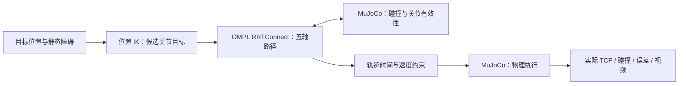

# SO101：以 MuJoCo 为核心的运动自主规划

2026-10-01 用户指定一个主方向并要求接入。位置 IK、OMPL 绕障、MuJoCo 碰撞与物理执行已实现；本地真实模型与 20 轮 ±3 mm 目标扰动已通过，Colab CPU / OSMesa 20轮通过，可见场景与视频回收已复验通过。保留原六秒合成轨迹基线入口。

## 目标与组件分工

第一阶段：输入起始关节、末端目标位置与静态障碍，自动生成无碰撞关节路径，在 MuJoCo 中执行并评估。第二阶段再增加可移动物体、接触抓放与视觉目标。实验尚未完成实体参数标定或真机状态同步，当前属于数字孪生的仿真基础。

MuJoCo 本身不负责搜索全局路径。IK 求出能到达目标的关节角，OMPL 搜索如何绕过障碍，MuJoCo 检查候选状态并验证物理执行。Mink 是局部 IK，必须检查残差和可达性，不能代替全局避障。

SO101 为五个机械臂自由度加夹爪。初期固定夹爪，只规划五轴；先约束三维位置，再按任务放松或增加部分姿态约束。任意六维末端位姿不得默认视为可达。旧 SRDF 的 arm 链以 moving jaw 为末端，包含夹爪关节；迁移时需明确拆分，不能直接沿用其状态空间。

## 已有资产怎样续用

| 资产 | 入口 | 核查结果与使用方式 |
| --- | --- | --- |
| 原生 MJCF / 13 个完整 STL / 许可证 | [MuJoCo 模型](../workspaces/so101_ws/src/so101_mujoco/models/so101.xml) | 直接作为主模型；末端 site 为 `gripperframe`。编译确认原有 13 个移动连杆 collision mesh；派生场景补四个底座 collision mesh，原资产不变 |
| Colab CPU 自动运行与回收 | [平台说明](../experiments/colab-twin/README.md) | 分配、上传、执行、下载、释放已实际通过，继续使用同一入口 |
| MoveIt / OMPL RRTConnect | [配置](../workspaces/so101_ws/src/so101_moveit_config/config/ompl_planning.yaml)、[执行器](../workspaces/so101_ws/src/so101_moveit_config/scripts/pick_place_runner.py) | 保留五轴/夹爪语义、限速与轨迹导出经验；`range=0.0` 是自动参数，不当作已验证数值直接照搬 |
| 既有 suite / report 周边 | [suite runner](../workspaces/so101_ws/tools/e2e/run_mtc_reach_benchmark_suite.py)、[验收汇总](../workspaces/so101_ws/tools/e2e/run_pre_real_acceptance_suite.py) | 复用规划/执行/收敛/距离/失败原因字段与逐轮输出约定；这些周边代码不能替代缺失的原 evaluator |
| 视觉 target / 数据标签匹配 | [candidate exporter](../workspaces/so101_ws/tools/hardware/export_vision_dataset_to_lerobot_candidate.py) | 后续保留 raw 与 canonical target 区别，防止物体标签、目标坐标和轨迹错配 |

当前 ROS URDF 为 17 个 visual、0 个 collision，不能直接用于可靠 MoveIt 避障；这不等于原生 MJCF 也没有碰撞几何。派生场景已补底座碰撞几何，并核对非相邻自碰、障碍与桌面检出。不要把 STL 的视觉形状、凸包和实际夹爪空隙默认视为一致。

旧 Gazebo 目标使用约 0.75 m 桌高和约 0.8 m 世界 z；原生 MJCF 在自身模型坐标下运行。迁移目标必须明确 world/base/TCP 变换，不能原样复制 xyz。五轴关节名、弧度单位、TCP site、夹爪状态和限位逐项对齐。

## 本地工程与历史边界

唯一开发根为 `projects/so101`；旧 `workspaces/so101_ws`、`so101-win7-follower-demo` 和桌面 follower 路径是兼容链接。`repo-revival/so101`、`repo-scan/so101-ros2-arm`、`repo-scan/so101` 与 delivery 是旧工程或发布副本；本轮所查规划文件没有更完整的 MTC 原件。独立 `lerobot` 源树存在 Placo FK/IK，可作后续比较，不把整个学习框架作为当前前置依赖。

- 2026-03-14 [非空导出日志](../workspaces/so101_ws/docs/evidence/gzm-004-export-20260314212123.log) 与多点轨迹支持“七个预设关节目标的 MoveIt 规划执行通过”的历史结论；本轮没有重跑。
- 2026-05-07 的任务记录描述 Cartesian IK/FK candidate → MTC → Gazebo reach。现存非空 jitter50 summary 记录规划 100%、执行/收敛 96%、reach 100%，但 reach 阈值为 8 cm，平均距离约 5.64 cm。
- jitter20 的 200 个逐轮文件、jitter50 的 500 个逐轮文件均为零字节。MTC C++ node、launch、原 grasp evaluator、视觉 projector 和 recorder 源码缺失，不能按 summary 宣称当前可复跑或精准抓取通过。
- 本地快照、有效 Git 路径历史和有界 Agent 历史检索未找回缺失 MTC 原件。损坏 Git 和零字节归档保留，不能覆盖当前源码；缺失线作为可恢复待办，不阻塞原生 MuJoCo 接入。

## 已接入算法与版本

| 组件 | 第一阶段候选 | 验证边界 |
| --- | --- | --- |
| 物理引擎 | MuJoCo 3.3.7 | 当前 Colab 基线已运行；原资产保持不变，场景修改在实验副本中完成 |
| 位置 IK | Mink 1.1.0 / DAQP | 五轴位置任务、多初值、关节/执行器范围交集、固定夹爪；无伪解 |
| 全局路径 | OMPL 2.0.1 / RRTConnect | 仅接受精确解；状态与每段按 5D 欧氏步长 ≤0.025 rad 离散检查，输出后重验 |
| 时间与速度 | 关节弧长 + quintic 进度 | 命令速度 ≤0.4 rad/s，启动/结束零速；分段折线拐角未提供加速度/力矩保证 |

最新版 Mink 1.3.0 要求 MuJoCo ≥3.10.0，不能无约束升级依赖。已在隔离环境验收并固定 requirements。实现参考：[Mink 示例](https://github.com/kevinzakka/mink/blob/v1.1.0/examples/arm_ur5e.py)、[Mink 依赖](https://github.com/kevinzakka/mink/blob/v1.1.0/pyproject.toml)、[OMPL Python 示例](https://github.com/ompl/ompl/blob/main/demos/RigidBodyPlanning.py)、[OMPL 发布](https://pypi.org/project/ompl/)。

## 实现顺序与最短验收

1. **可达性与模型语义**：确认 TCP、五轴限位及坐标转换；给定可达位置，IK 收敛并通过 FK 残差检查；明显不可达目标必须返回无解。第一版仿真到达容差为 1 cm，作为新的配置和验收标准，不与旧 8 cm reach 数字混用。
2. **碰撞与路径**：验证碰撞检查器能检出刻意放置的障碍和自碰；构造起终点有效、直线路径被阻挡的场景，RRTConnect 自动绕行。检查路径中间路段和最小间隙；阻死通路应失败或超时，禁止默默回退到直线。
3. **执行与报告**：规划与执行使用独立 `MjData`；候选查询用 `mj_forward`，物理执行用 `mj_step`。记录实际 TCP、误差、碰撞、关节限位、控制指令和时间连续性；跟踪失败与规划失败分别报告。输出沿用平台的 CSV / JSON / MP4。

先跑上述正反例，再用固定随机种子做 20 轮小批量，报告成功率、距离分布、规划时间及失败原因。本地 20 轮均通过，可见场景与视频回收已复验通过。MuJoCo 仿真结果不得当作真实机械臂参数或实机动作放行证据。

## Gazebo 可以在 Colab 用吗

可以作为条件成立的无头仿真候选，本项目尚未实测：

| 用途 | 判断 |
| --- | --- |
| 纯物理、轨迹与碰撞 | server-only 可用 CPU；须确认运行时 Ubuntu 与 Gazebo 软件包匹配 |
| 相机、深度图等渲染 | OGRE2 + EGL 的 `--headless-rendering`；官方推荐 GPU，也允许软件渲染，性能与驱动须实测 |
| 桌面 GUI | 需要显示和远程桌面；不作为本阶段 Colab 入口 |

Gazebo [官方无头渲染文档](https://gazebosim.org/api/sim/8/headless_rendering.html) 给出 server/EGL 例程。[官方 ROS 配对](https://gazebosim.org/docs/harmonic/ros_installation/) 中 Jazzy 默认搭配 Harmonic，Humble 默认搭配 Fortress；本工程旧 Classic 插件和 launch 仍需迁移。

[Colab FAQ](https://research.google.com/colaboratory/faq.html) 说明资源与虚拟机生命周期有限，免费且没有正计算余额的托管运行时限制 SSH/远程桌面等远程控制。后续若需要 Gazebo 对照，应做范围明确的无头实验；当前主线继续使用已经跑通的 MuJoCo。

## AGY 咨询与接续 owner

2026-10-01 实际用 AGY CLI 的 plan/sandbox 模式做单次只读咨询，仅提供上述核实摘要。AGY 推荐 MuJoCo + Python IK/OMPL，先验收可达性、碰撞检出与闭环跟踪。采纳主方向与顺序；其“Ground Truth”措辞仅能理解为仿真内参考，不能替代真实标定。其对性能和历史误差来源的判断仍属待验证意见。

根 Codex 负责从 [当前计划](../plans/colab-digital-twin-20261001/task_plan.md) 接续，位置到达之外的接触抓放、视觉与实体同步仍未完成。Gazebo、MTC 恢复与真机延迟保持各自历史边界。个人文档、原始咨询、标定和运行产物留在 Git 排除区。

## 本轮实现与验收证据

入口为 [实验 runner](../experiments/colab-twin/run_experiment.py)，组件分别是 [位置 IK](../experiments/colab-twin/position_ik.py)、[关节规划](../experiments/colab-twin/joint_planner.py)、[场景/碰撞](../experiments/colab-twin/collision_scene.py) 和 [物理执行/评估](../experiments/colab-twin/planning_experiment.py)。目标和盒子由 [公开场景配置](../experiments/colab-twin/planning_scenario.json) 指定，没有预置绕行 waypoint。目标单位 m，五轴规划/控制单位 rad，TCP 为 `gripperframe`，坐标均为原生 MJCF world/base。

- 本地 29 项测试通过：真实模型 IK、限位与错误输入、盒子/桌面/非相邻自碰、路径中间碰撞、完全隔断时拒绝 OMPL 近似解、物理执行与错误目标、云端资源释放失败路径。
- 障碍正例：起终点有效，直接关节插值被盒子挡住，RRTConnect 自动绕行；主物理执行误差约 0.549 mm，20 ms 检查无无效采样。
- 本地 ±3 mm Cartesian 扰动 20/20 通过，20 条直接路径均被挡；末端误差均值 0.545 mm、p90 0.561 mm、最大 0.589 mm，采用新的 10 mm reach 标准。这里只覆盖一个静态盒子附近的小扰动任务。
- 明显不可达位置返回 `unreachable/qpos=None`，代表有界数值搜索无候选，不是数学不可达证明；完全封闭场景返回 `invalid_start/path=None`。有效起终点但无路的独立算法测试也拒绝近似解。

碰撞装配策略仅排除同刚体、六对直接父子连杆，以及固定底座/工作台安装接触；非相邻自碰和机器人/盒子仍启用。父子凸包装配重叠在派生 XML 的 `contact/exclude` 中同步排除，确保物理与规划语义一致。规划夹爪固定 0.35 rad；执行查询使用真实六轴值，允许动力学微小夹爪偏差，不用指令值替代实际姿态。

MuJoCo 3.3.7 的 native CCD 在本模型上出现纯底座 yaw 改变但非相邻距离误报 0 的现象，因此派生 XML 显式 `nativeccd="disable"`，使用 libccd；15 个 yaw 回归点的距离保持不变。官方说明 [legacy CCD 分离距离近似](https://mujoco.readthedocs.io/en/3.3.7/XMLreference.html#option-flag-nativeccd)，报告最小距离只能当作凸包模型诊断，不能称真实安全间隙。规划为 ≤0.025 rad 离散边检查，实际执行每 20 ms 检查；没有连续碰撞保证。原 MJCF 和 13 个 STL 哈希不变。

OMPL 全局种子只在进程第一次规划设置（0 映射为 1），后续按顺序使用同一 RNG 流；Mink 和目标 jitter 使用各自固定种子。重复批次需要新进程与相同调用顺序，规划耗时和跨平台数值仍可能有差别。
