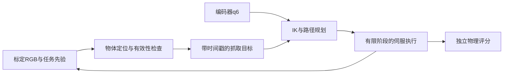

# SO101 方法审查与稳定抓放主线

日期：2026-10-06。用户已明确选择：**稳定自主抓放，视觉定位＋已有IK/OMPL；学习策略作为支线。** 本次完成源码/报告/官方资料审查与CPU统计；未训练、加载模型、渲染、积分或分配云端实例。新视觉控制入口尚未实现，以下v1运行条件是下一次实现的预置方案，不是已通过的指标。

## 决定与历史边界

MuJoCo、已有单臂模型、碰撞检查、IK/OMPL与接触抓放继续复用；暂不迁移Isaac/Gazebo、引入新训练框架或追加ACT训练。空载全局避障复用OMPL，持物段保留已有竖直笛卡尔IK与载荷碰撞检查，不能笼统宣称现有所有搬运段都由OMPL完成。原A/B与全部失败产物保留，S7d/S7e失败不会因切换工程主线变为通过。

原七项门控文件本身就声明为“保守诊断准入”，并非物理任务验收。首帧幅比0.5–1.5未被证明是抓放成功的必要条件；此前不挑选快照/不临时改规则符合当轮预置协议，但不能把“只取最后checkpoint”升级为今后所有学习实验的原则。新工程主线按定位、安全、真实夹持与落盘分别验收，不再等待ACT逐动作拟合过门。碰撞、限位和物理成功标准仍保留。

依据：[原门控](../../experiments/colab-twin/output/vision-colab-balance-20261006/offline-gate-spec.json)、[上一轮结果](../../experiments/colab-twin/output/vision-colab-balance-20261006/REPORT.md)、[用户方向决定](../../docs/DECISIONS.md#d005稳定自主抓放优先视觉定位与已有规划act转为支线)。

## 集中方法审查

### 配方与官方实现

本机确实使用固定官方ACT源码，但实验配方是自定义轻量诊断：随机初始化ResNet18、128×128、256维/2层encoder/2层decoder、无VAE/dropout、外部RGB除255、h0残差统计归一化及手写fresh Adam1e-4循环。不能把“官方网络代码”称为“完整官方训练基线”。同revision官方默认主干有ImageNet初始化，Transformer/VAE及优化器默认也不同。

来源：[本地模型配置](../../experiments/colab-twin/learning_vision.py)29–36、435–450行；[本地优化器](../../experiments/colab-twin/run_vision_learning.py)237–290行；[固定revision官方配置](https://raw.githubusercontent.com/huggingface/lerobot/e0d50211ef236143ae867228662b7dfaba554f02/src/lerobot/policies/act/configuration_act.py)。

### 数据与独立性

8797条有效帧来自四份同布局、相关的示范/恢复档案，不是8797次独立任务。更多采样曝光不增加任务覆盖。`VisionDataset`实际要求同camera、同模型/场景和物理周期；当前fit没有train/validation划分，所有四档都用于统计归一化与训练。

若以后恢复ACT，按独立初态/采集家族分组划分训练、验证、最终测试，不能随机拆帧或把同一轨迹前缀/恢复后缀分到两组。归一化只在训练组拟合；验证用于预置选模，最终测试只做一次验收。仅把现有四档作3+1拆分不足以自动建立独立验证证据。

来源：[数据加载](../../experiments/colab-twin/learning_vision.py)350–403行；[fit循环](../../experiments/colab-twin/run_vision_learning.py)237–367行；[独立数据/评测审查](../../experiments/colab-twin/output/vision-method-review-20261006/evaluation-review.md)。

### 动作尺度与L1边界

归一化统计来自有效unique行的`a[t]−q[t]`，未来槽监督是`a[t+h]−q[t]`。编码/解码相互一致，没有据此发现错一拍或不一致解码；但h0统计没有覆盖完整chunk目标尺度。

| 轴 | uniform合法槽 std(h15)/std(h0) | B5000实际采样 std(h15)/std(h0) |
| --- | ---: | ---: |
| pan | 22.2822 | 22.2835 |
| lift | 21.6649 | 21.5834 |
| elbow | 21.6367 | 21.5998 |
| flex | 21.1013 | 21.1415 |
| roll | 20.8450 | 20.9104 |

B5000保存的前150条专家观测中，尾15槽占99.379%的归一化L1损失值。这支持“单一总loss不足以代表h0质量”，不能当作全训练集或参数梯度份额。实际官方损失对有效元素取L1均值；非零残差对归一化输出的梯度绝对值为1/N，并不随残差幅度增长。**不能由21–22倍标准差直接推出尾槽单元素梯度放大21–22倍，或宣布找到唯一根因。** 共享参数的梯度还依赖Jacobian与符号。

来源：[本地归一化与batch](../../experiments/colab-twin/learning_vision.py)147–183、412–427行；[固定官方L1实现](https://raw.githubusercontent.com/huggingface/lerobot/e0d50211ef236143ae867228662b7dfaba554f02/src/lerobot/policies/act/modeling_act.py)；[CPU逐槽复算](../../experiments/colab-twin/output/vision-method-review-20261006/action-audit/REPORT.md)。本次复算不加载模型、不新增前向。

### 选模与预算

[原ACT训练源码](https://github.com/tonyzhaozh/act/blob/main/imitate_episodes.py)有验证集与最佳验证checkpoint；[robomimic文档](https://robomimic.github.io/docs/tutorials/viewing_results.html)将验证、周期rollout及按成功率保存模型分开。以后应预先规定选模频率、指标、并列处理与最终测试隔离，而不是看完结果挑赢家。

[LeRobot ACT指南](https://huggingface.co/docs/lerobot/act)给出约50示范与100k步的参考量级；它们不是SO101保证成功的配额，更不是现在自动放大20倍预算的理由。当前ACT支线新增训练预算为0。重启前需要新的独立数据切分、动作表示/预训练与预处理基线、h0/全chunk分开报告以及总预算；完整基线恢复可能改变多个配置，届时应称新基线对照，不能伪装成单变量实验。

## 工程主线v1：有限场景的视觉抓放

范围：一个绿色方块，已知尺寸/朝向/高度假设，固定工作台、红蓝盘及静态障碍地图；目标的XY位置从图像估计。场景XML已定义`topdown`相机，先验证其可见性并重新标定，候选直接渲染640×480；现有ACT HDF使用-40°斜视相机，不能直接复用其标定，也不将128图片放大冒充新增分辨率。固定相机标定与已知高度平面是显式工程先验，不声称通用6D视觉或真机标定。

首个感知基线采用颜色/连通域加标定平面反投影，参考[OpenCV颜色分割](https://docs.opencv.org/4.13.0/da/d97/tutorial_threshold_inRange.html)与[平面单应性](https://docs.opencv.org/4.13.0/d9/dab/tutorial_homography.html)。输出米制位置、几何有效性、时间戳和失败原因；反投影采用已知物体顶面高度，再转换到物体中心/抓取点；像素包围框中心不能直接当三维抓取点。物体高度/倾斜不满足平面假设、遮挡或检测歧义时应拒绝/重新观测，不能静默读取目标真值兜底。若需要RGB-D/多视角，另行调整观测协议，不冒充本轮单RGB能力。

### 先消除控制中的真值依赖

当前专家不能直接改名为视觉控制器：

- `grasp_episode.py`349–358行：闭爪/释放条件直接读取物体真实位置/姿态。
- 同文件的grasp_ready与释放时盘底接触判断也会影响动作/阶段；这些读取同样需要隔离，不能只改一个target参数。
- 同文件418–421行：受扰后用真实物体中心重新解IK；初始路线也有固定XY目标，须由视觉目标参数替代。
- `placement.py`25–30行：载荷相对抓手位姿来自真实物体变换；要改为可观测抓取估计＋明确的不确定性包络，不能保留隐藏oracle。
- `placement.py`74–110行：现有持物竖直路线可复用，但固定路径点与终点的任务先验要显式声明。

工程控制允许显式阶段机、IK/OMPL及编码器反馈；它与“纯ACT”是不同控制器。MuJoCo物体真值留在独立评分器；若以后控制要用仿真接触/力传感器，必须单独声明其输入与现实对应，不把真值评分反馈伪装为视觉估计。碰撞查询可用机器人模型和已知静态地图，动态物体查询采用估计值。

接口隔离建议：感知函数只接收RGB/标定/先验；任务控制只接收估计目标/q6/已声明传感量；评分器单独持有目标真值。先用受限接口和反例检查证明没有目标真值旁路。

### 可执行顺序与停止条件（候选，实施前冻结）

| 阶段 | 范围与输出 | 退出条件 |
| --- | --- | --- |
| P0 静态定位 | 固定相机，20个不同有效XY位置，另加遮挡/缺物反例；叠加像素点与米制估计 | 候选定位阈值最大XY误差≤2mm，反例拒绝；此阈值是感知诊断上限，不是抓放充分条件；最终误差预算还需计入IK残差与执行跟踪误差。未过先停在标定/感知 |
| P1 单回合 | 视觉位置替代固定抓点与目标真值；执行完整夹起、避障、放盘 | 原抓取/放置判据通过；空夹、掉物、碰撞、超时都失败。不以路径规划成功替代物体搬运 |
| P2 开发集 | 预先固定10个不同初始XY案例：5正常、5接近段扰动；基线与至多一个针对已定位原因的修正版使用相同开发案例 | 候选门槛10/10且无安全停机。先排除发生安全违规的候选，再按开发集成功数选取；平分保留原基线。至多一次修正后仍未达门槛就结束pilot，不进入P3 |
| P3 冻结验收 | 新生成并保存的20不同位置正常回合＋20扰动回合；不只是换seed复跑同初态 | 候选正常20/20、扰动≥17/20、safety_stop=0；失败/拒绝全部计入分母。固定验收配置后不得据结果调参再重用同集 |

P0–P3所有实际运行合计墙钟预算建议30分钟，无Colab训练分配；单物理回合沿用最多90s仿真/120s墙钟。超出总预算就标记未完成并保留结果，不把剩余回合算通过；达到失败边界无需耗尽预算。正式分布在执行前固定：目标XY候选相对红盘中心±10mm，姿态/地图不变；接近段脉冲沿用五轴±0.02rad、0.2s，注入时机绑定任务事件与清楚日志。每次随机实际值落盘，不以seed本身作为多样性证据。批次阈值是本任务工程验收目标，不是置信度或真机可靠性保证。

碰撞/限位标准保持；真实夹持要求物体抬升与双指接触持续成立，放置要求真实进入蓝盘、盘底支撑、松爪、低速并稳定至少1s。主评分复用阶段无关的[PhysicalTaskMonitor](../../experiments/colab-twin/learning_env.py)57–96行，保持其物理阈值；[grasp_acceptance](../../experiments/colab-twin/grasp_episode.py)139–149行与[placement_acceptance](../../experiments/colab-twin/placement.py)118–138行依赖阶段名称，只在名称对齐时交叉核对。独立评分不得供控制读取。原已有模型采用臂部1mm保护、载荷规划0.2mm余量，二者不可混写。

## 当前完成与下一入口

本轮已完成方法审查、动作尺度CPU复算和用户方向落库。视觉定位接口、目标真值隔离及P0–P3尚未实施/执行。下一入口由根Codex从P0标定/静态定位开始，随后接已有抓放执行器；不继续冻结换图→再加权训练的默认循环。

采用既有知识“按当前任务选择验收依据”（Obsidian `Wiki/自动化开发范式与智能体协作.md`5–11行），用于区分报告可信、动作拟合、安全与任务成功；CapMesh能力索引与PIT-003用于复用既有仓库、保持产物Git排除。本轮只有项目特定结果，不另写全局经验规则。
